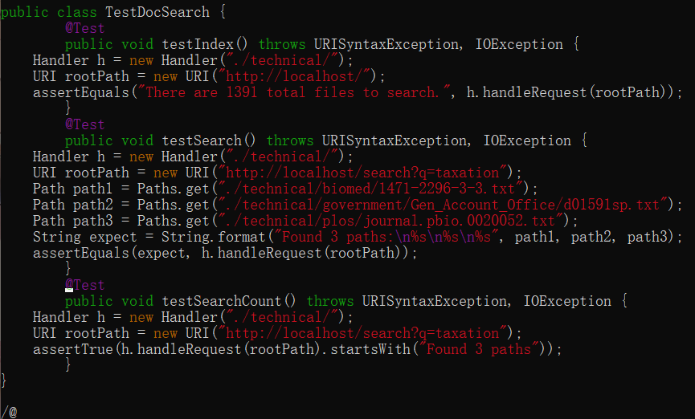
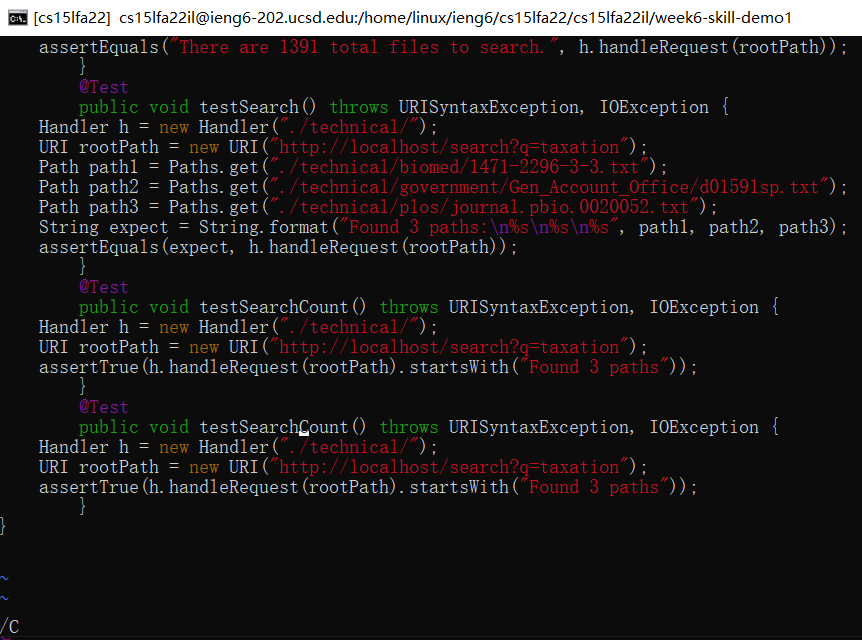
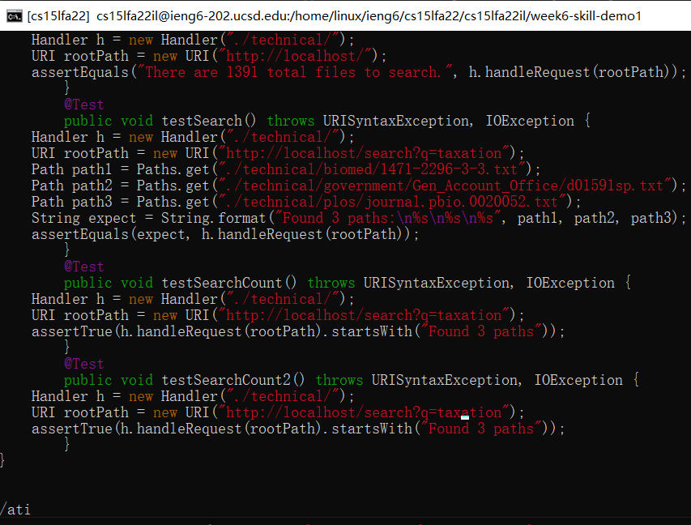
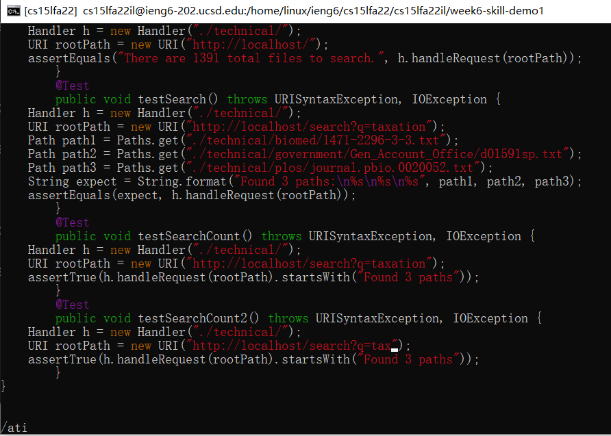
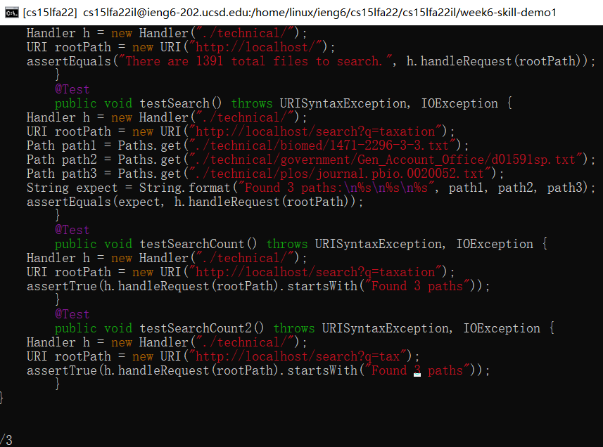

# Lab Report 4  
## Part 1
* In our lab group, we attemped the __chanllenge__ task:  
 `In TestDocSearch.java, copy the test called testSearchCount, rename the new test to testSearchCount2 and change the query string being tested to tax rather than taxation.`  
 * The steps we took: (38 keystrokes)  
 1. `/@ <Enter> nn`   find the where is __@__ located at  
   
 2. `6yy`   to copies the 6 lines that is under where do we find the third __@__  
   
 3. `kp`   paste the what you copied  
   
 4. `/C <Enter> n`   to find where is the Second __C__ located at  
   
 5. `ea2 <Esc>`   add the __2__ after we loacted where is the __parentheses__ that next to the __C__ we that located already  
   
 6. `/ati <Enter> n`   search for the where is the second __ati__ locate  
   
 7. `5x`   to delete the __5__ character after we located the __ati__  
   
 8. `/3 <enter> n`   search for where is the second __3__ locate 
   
 9. `i <rightrow> <delete> 161`   replace the __3__ to the __161__  
   
 10. `:w <Enter>`   to save the any __change__ that you makes
  
 ---
## Part 2  
__Method 1: Edit in the Local__  
* This method took me about 3 minutes. The first method takes more time than do the second method. It think it because that in the first method you have to use the `scp command` to replace the old file to the new file that you finish edit already. When I using the `scp command` I have to type a lot to make the command work. Also that the speed that I edit the local file is slower because I rely on using the mouse, instead of using the shortcut of keyboard in VIM command.  

__Method 2: Remote editing using VIM__  
* This method took me about 1 minute 30 second. I can edit the file remotely and no need to use the `scp command` to upload the file. After I finished editing in the VIM system, then I can just use the `bash test.sh` to run my code immediately.  

__Which of these two styles would you prefer using if you had to work on a program that you were running remotely, and why?__  
* If I could edit the file on the remote sever, I will choose to use the VIM system to edit the file. It is because that it reduces the time of copying files remotely from the local computer to the remote server and moving the files to the appropriate directory.   

__What about the project or task might factor into your decision one way or another? (If nothing would affect your decision, say so and why!)__
* If there is only 1 ot 3 files that I need to edit, I will use the second method. Other than that, I will use first method because __IDE__, such as VSCode because it is easy to access and make change. However, I still need to use the `scp command` to copy the file into the remote server. 

