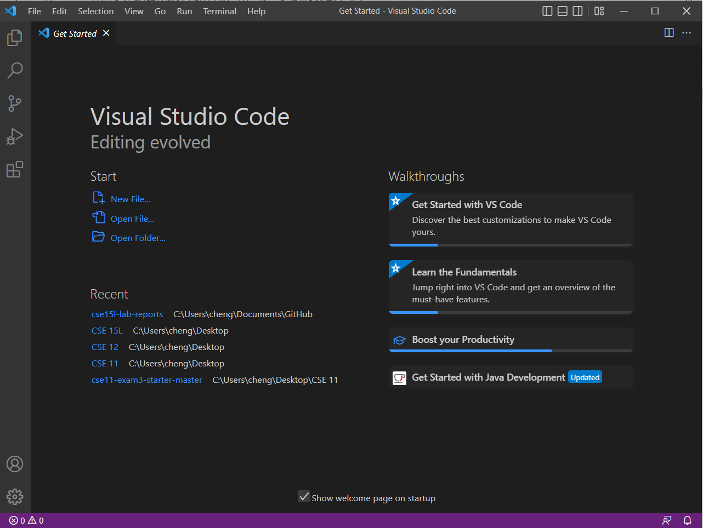
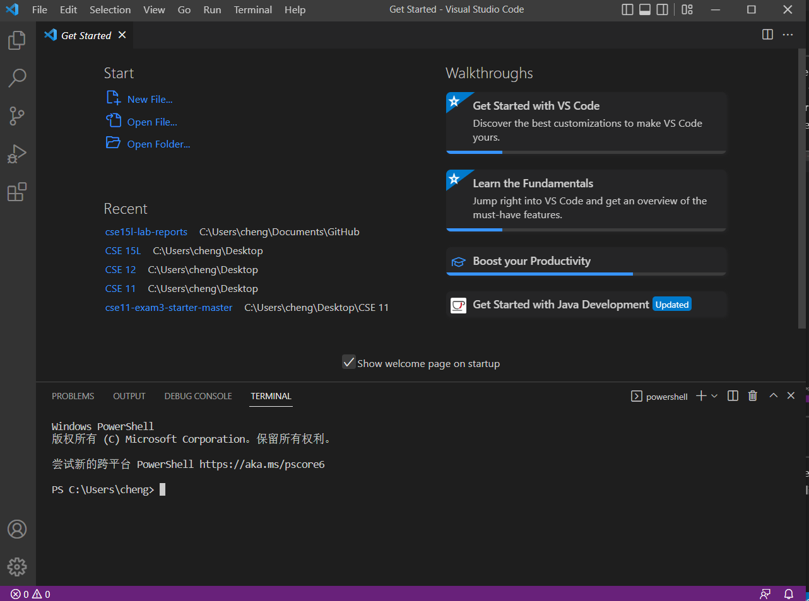
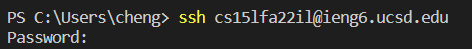
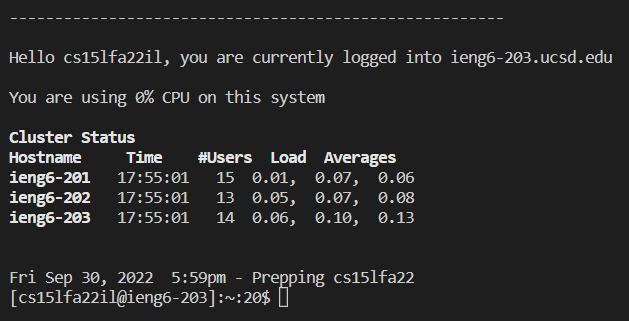
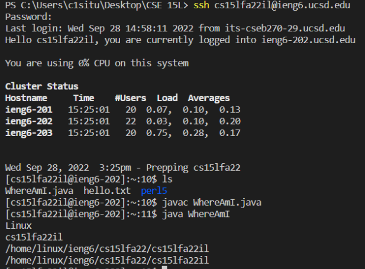
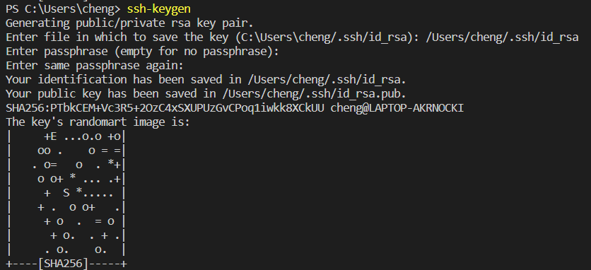
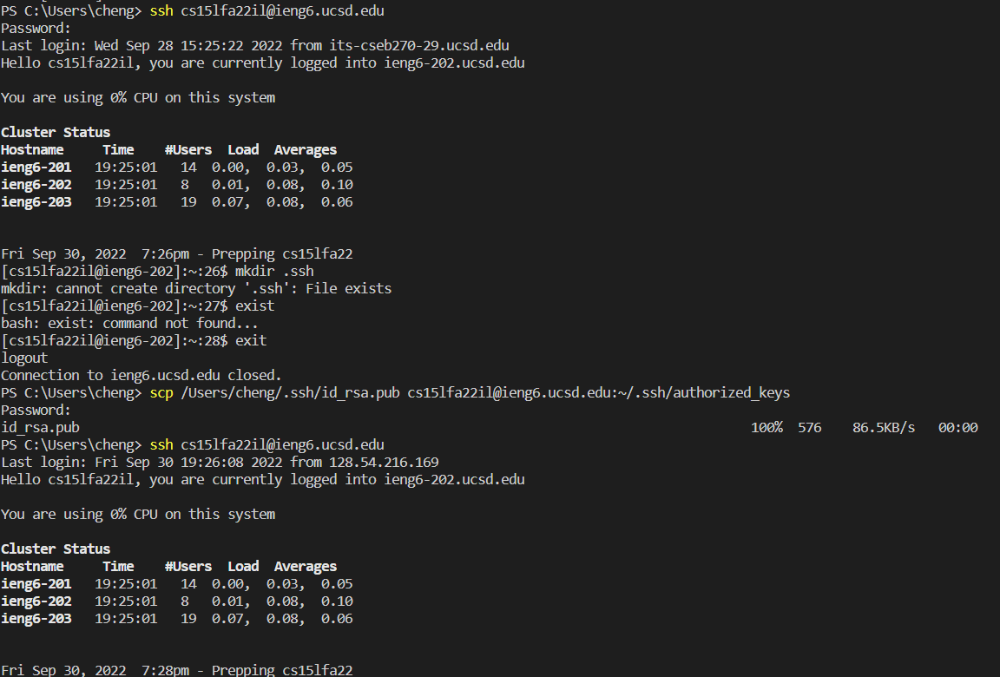
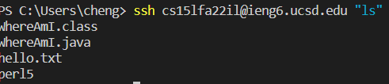

## Step 1 Installing VScode
---
* If you have not download the VScode on your computer, then click this [link](https://code.visualstudio.com/), follow the instrustion on the website.
*  **Can not install on a chromebook or a table.**
 
* After you download and install it, when you open it will looks like this:

 
---
## Step 2 Remotely Connecting
---
* After you finish download the VScode and open it, you can click Terminal at the top of VScode, then click the new terminal. After you finsih you will something like this:

* Then you can type your specific account in the terminal. For example: ssh (Your account number)@ieng6.ucsd.edu
* If you was first time log into the remote server, you will something like this:
 
**ssh cs15lfa22zz@ieng6.ucsd.edu**
 
**The authenticity of host 'ieng6.ucsd.edu (128.54.70.227)' can't be established.
RSA key fingerprint is SHA256:ksruYwhnYH+sySHnHAtLUHngrPEyZTDl/1x99wUQcec.
Are you sure you want to continue connecting (yes/no/[fingerprint])?**
* Then you need type yes. After that you will see something like this:

* Then you need to type your password in order to log into remote server.
* When you finish log into the remote server you will see something like this:

---
## Step 3 Trying Some Commands
---
* **Congulation, you have successfully log into the remote serve**
* At now, you can use command like cd, ls, pwd, mkdir, and cp to tell your remote server what you want to do. 
For example:

* You can try you own now, have fun to play with those command! 
---
## Step 4 Moving Files with scp
---
* In your VScode you can create a file name it **WhereAmI.java**
* In that new file you should put:  
**class WhereAmI { 
  public static void main(String[] args) {  
    System.out.println(System.getProperty("os.name"));
    System.out.println(System.getProperty("user.name"));
    System.out.println(System.getProperty("user.home"));
    System.out.println(System.getProperty("user.dir")); 
  }  
}**
* In your terminal, if you did not log out from remote server, you can type the exit to log out first. Then type:  
**scp WhereAmI.java (your account number)@ieng6.ucsd.edu:~/**
* After you type, you will see, it require to use your password to log in. Type you password and click enter. Your file will successfully upload to the remote server.
* Then when you log into your remote server and type **ls** you will something like this:  

---
## Step 5 Setting an SSH Key
---
* First you have to use **exit** to log out from remote server.
* type **ssh-keygen** in the ternimal, then select the a profile that you want to save the private SSH key, click enter and keep click the enter until it show up something like this:  

* After you finish doing the things above, you need to use **ssh** login in back to remote server. Typing **mkdir .shh**. After that you need to log off from the remote server
* After you log off from remote server you have to use **scp** to upload your public key in order to make the key work. Format: 
**scp (/Users/joe/.ssh/id_rsa.pub)-->(change to your public key file location) (cs15lfa22@ieng6.ucsd.edu) --> (change to your account number):~/.ssh/authorized_keys**
* After you done with all those step, congratulation you can log in without using the password.

---
Step 6 Optimizing Remote Running
---
* Right now you done with ssh-key, you can try something that can save less time to type other stuff like:  
**ssh (cs15lfa22) --> (change to your account name)@ieng6.ucsd.edu "ls"**   
Result:  

* You can try to run multiple command on the same line in order to save the time. Use your imagination! 
---