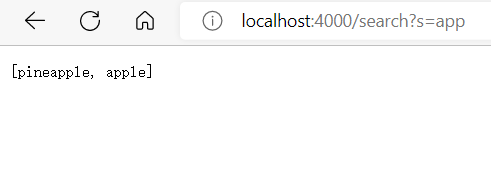

## Search Engine
---
* This is my code for the SearchEngine
 

* For this code, if you want to run this code, you need to type --> javac Server.java (Your Search Engine's file name).java in the Ternimal.  
 Then --> java (Your Search Engine's file name) (some number greater than 4000)
* It will go out a link, Shift + click get into it. Like this:

* Then when you type /add?s=anewstringtoadd at the back your website like this:

* In the code, it will sorted that word that you put into a arraylist in order to do it in the search late. 

* The red circle that I draw that is the add method is working at that place. I just try to sort the word into a arraylist
* Same way, I add two similar words into the arraylist again by same way that I add word before like this:

* After I done that, my arraylist will sort **3** different words (**anewstringtoadd**, **apple**, **pineapple**)
* Next, we can use the search method to find some words that contain the character that you are looking for. There is search method in my code: 

* From my code, I write get key word that you want me to look for, then I use for loop to get every words that you adds into the list and try to find out every word that contain key word that you put. Then put those qualified word into a new arraylist and return them.  
**For Example:**

* From here, you can see that I want to find any words that include **"app"** and before I add three words into the word bank: (**anewstringtoadd**, **apple**, **pineapple**). 
* The words that qualifed the requirment is only **apple** and **pineapple**. My code also shows that.
 
---
## Part 2: **Bugs fix**
---
