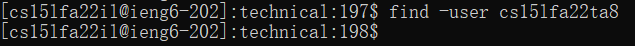

## Research Command
---
* I choose the **Find** command to be my Research command
* From the Internet, I find **3** intersting find-command **options** to find something in the remote server. They are: <br>
    * **-name** options (two ways)<br>
        * ```find ./biomed(some directory) -name *txt(some files that you want to find)```
        ```find ./biomed(some directory) -name sample.txt(one file that you want to find)```
    * **-iname** options <br>
        * ```find ./government(directory) -iname sameple.txt(file that you want to find)```
    * **-user** options <br>
        * ```find -user cs15ilfa22il(user name that you put)```
<br>

* let's talk about the **-name** options First.
    * Basiclly, the **-name** options is **Search for files that are specified by ‘something that want to put it’.**
    * The code that we need to type in the command is:<br/>
     <br/>
    ```find ./GFG(some directory) -name *txt(some files that you want to find)``` <br>
    **./GFG** is the directory that you want to look for. <br>
    ***.txt** is some files that you want to find out. 
    * Base on that, I try some command code into the online server as example: <br>
    <br>
    The command code that I used to get some files that I want is __find ./biomed -name *.txt__ <br>
    This command code will list out any files that is ending with ***.txt** and in the **biomed** directory
    * Second example: <br>
    <br>
    At this time, this command code will list out any files that is ending with ***.txt** and in the **plos** directory
    * Third example: <br>
    <br>
    At this time, this command code will list out any files that is ending with ***.docs** and in the **government** directory, but the result come out is nothing is listing out. This means that in the **government** dierctory, there is no files that end with **.docs**. <br>
<br>    

* Other ways that we can use **-name** options to find specific files
    * This is going to find a file that is **exactly** match to **your input**
    * This option can help you to find the file that you **exactly** want to find
    * The code that we need to type in the command is: <br/>
     <br/>
    ```find ./GFG(some directory) -name sample.txt(some files that you want to find)``` <br>
    **./GFG** is the directory that you want to look for. <br>
    **sample.txt** is some files that you want to find out. 
    * Base on that, I try some command code into the online server as example: <br>
     <br>
    For this time, this command line code means that, I want to find the files name is **Redacted_Study.txt** in the **government** directory. 
    * Second Example: <br>
     <br>
    At this time, this command line code means that, I want to find the another files that name is **predatory_loans.txt** in the **government** directory. 
    * Third Example: <br>
     <br>
    At this time, this command line code means that, I want to find the another files that name is **predatorys.txt** in the **government** directory, but there is **nothing** after kick enter. This means that there is no such files that is name **predatorys.txt** in the **government** directory. <br>
<br>    

* Second **options** that I want to says is: **-iname** <br>
    * Basiclly, the **-iname** options is **Search for files that are specified by ‘something that want to put it’ irrespective of upper/lower case.**
    * The code that we need to type in the command is:<br/> 
    ```find ./biomed(some directory) -iname redacted_study.txt(some files that you want to find)``` <br>
    **First Example**: <br>
     <br>
    From here, we can see that it is really similar to **-name**'s usage. It is trying to find some files that is name **redacted_study.txt** in the **government** directory. <br>
    From the result, We can see that that file name is **Redacted_Study.txt** not the what we put **redacted_study.txt**. It is because that **-iname** option only match the characters, it did not care about the Upper/lower case. 
    * Another example:<br>
    <br>
    For this command-line code, It is trying to find some files that is name is start with **cohenetal_** in the **government** directory.
    * Last example: <br>
    <br>
    For this command-line code, It is trying to find some files that is name is start with **mitchell_** in the **government** directory. <br>
<br>

* Last **option** is **-user**: <br>
    * Basiclly, the **-user** options is **Search for files owned by user name or ID "name"**.
    * The code we need to put in the command is:<br>
    ```find -user cs15ilfa22il(user name that you put)``` <br>
    **First Example:** <br>
    <br>
    From this result, we can see that it is trying to find any files that is own by **cs15lfa22il**. Which any files in this account is all belong to me because I do it on remotely with my account. 
    * Second Example: <br>
    <br>
    From this result, we can see that it is trying to find any files that is own by **cs15lfa22**. Of course, there is nothing that is belong to this account **cs15lfa22** because I do it on remotely with my account. <br>
    * Third Example: using a actual ID: <br>
    <br>
    From this result, there is **nothing** in this files that is belong to the TA's ID **cs15lfa22ta8**. It is because that I do it remotely in my account.
<br>

**That is, Thank you for spend time to read through this report!!**