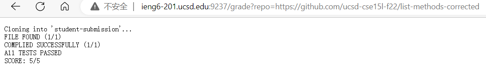
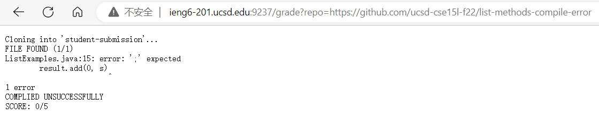
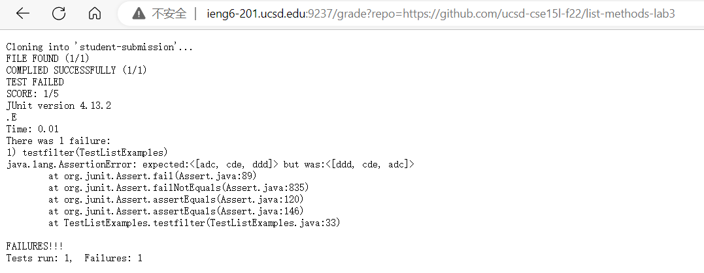

# Lab Report 5 <br>

## Grading Script <br>

```
set -e

rm -rf student-submission
mkdir student-submission

git clone $1 student submission
cp TestListExamples.java student-submission
cd student-submission

CPATH=.:../lib/hamcrest-core-1.3.jar:../lib/junit-4.13.2.jar

if [[ -f ListExamples.java ]];
then
    echo "FILE FOUND (1/1)"
else
    echo "FILE NOT FOUND (0/1)"
    echo "SCORE: 0/5"
    exit 1
fi

set +e

javac -cp $CPATH *.java > compile-error.txt

if [[ $? -eq 0 ]]
then
    echo "COMPILED SUCCESFFULLY (1/1)"
else
    echo "COMPILED UNSUCCESSFULLY (0/1)"
    echo "SCORE: 0/5"
    cat compile-err.txt
    exit 2
fi

java -cp $CPATH org.junit.runner.JUnitCore TestListExamples > test-error.txt

if [[ $? -eq 0 ]]
then 
    echo "ALL TESTS PASSED"
    echo "SCORE: 5/5"
    exit
else
    echo "TEST FAILED"
    echo "SCORE: 0/5"
    cat test-err.txt
    exit 3
fi
```
<br>

### Example 1: <br>
* Repository link: https://github.com/ucsd-cse15l-f22/list-methods-corrected <br>
 <br>

### Example 2: <br>
* Repository link: https://github.com/ucsd-cse15l-f22/list-methods-compile-error <br>
 <br>

### Example 3: <br>
* Repository link: https://github.com/ucsd-cse15l-f22/list-methods-lab3 <br>
 <br>

---

## Script Trace <br>

```
set -e

rm -rf student-submission
mkdir student-submission

git clone $1 student submission
cp TestListExamples.java student-submission
cd student-submission

CPATH=.:../lib/hamcrest-core-1.3.jar:../lib/junit-4.13.2.jar
```
<br>

* `set -e` is used to exit the shell script, if the exit code is not 0.
* `rm -rf student-submission` and `mkdir student-submission` is going to remove the old student-submission and create a new directory.
* `git clone $1 student submission` and `cp TestListExamples.java student-submission` is going to clone the new student submission repository into the diretory and moved the `TestListExamples.java` into this diretory.
* `cd student-submission` is using to locate the **student-submission** diectory.
* `CPATH` is creating a short variable for calling the JUNIT. <br>

```
if [[ -f ListExamples.java ]];
then
    echo "FILE FOUND (1/1)"
else
    echo "FILE NOT FOUND (0/1)"
    echo "SCORE: 0/5"
    exit 1
fi
```
* Using the `-f` command to search the whether ListExamples.java file exist or not. <br>
    * If the file exists, the student will have one points.
    * otherwise, the student will don't have any point and exit the grade script immediately.
<br>

```
set +e

javac -cp $CPATH *.java > compile-error.txt

if [[ $? -eq 0 ]]
then
    echo "COMPILED SUCCESFFULLY (1/1)"
else
    echo "COMPILED UNSUCCESSFULLY (0/1)"
    cat compile-err.txt
    echo "SCORE: 0/5"
    exit 2
fi
```
* `set +e` is used to let the script keep running after exit code is ran. 
* The `if` statement is trying to find out whether exit code is equal to zero or not <br>
    * If the exit code is zero, the student will get one point
    * otherwise, the student will don't have point. Then the system will print out the compile-error.txt with **stderr** to let student to know where do they get wrong <br>

```
java -cp $CPATH org.junit.runner.JUnitCore TestListExamples > test-error.txt

if [[ $? -eq 0 ]]
then 
    echo "ALL TESTS PASSED"
    echo "SCORE: 5/5"
    exit
else
    echo "TEST FAILED"
    echo "SCORE: 0/5"
    cat test-err.txt
    exit 3
fi
```

* Using the `java` to run the TestListExamples and the **stderr** will stored into a new file called **test-error** 
* The `if` statement will try to find out whether the exit code of `java` is equal to zero or not
    * It do equal to zero, then the student will get full point
    * otherwise, the student will not receive the point and print out the **test-error** file to let student know where do they get wrong and script stop and exit.

